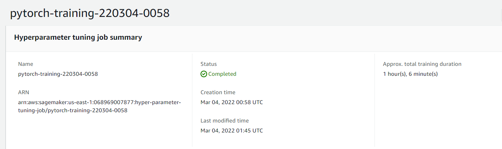
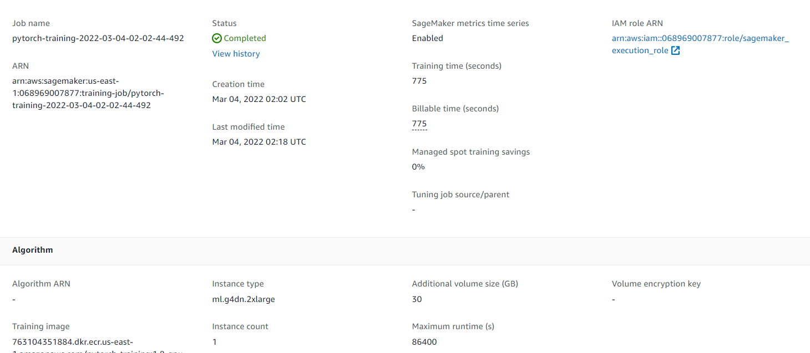

# Image Classification using AWS SageMaker

Use AWS Sagemaker to train a pretrained model that can perform image classification by using the Sagemaker profiling, debugger, hyperparameter tuning and other good ML engineering practices. The dataset for this project is https://s3-us-west-1.amazonaws.com/udacity-aind/dog-project/dogImages.zip. The goal of the project is to create a classifier capable of determining a dog's breed from a photo.

## Dataset
The dataset I'm using for this project is dog breed dataset (https://s3-us-west-1.amazonaws.com/udacity-aind/dog-project/dogImages.zip). After unzipping, there are three folders - train, valid and test, with each containing 133 subfolders, representing 133 dog breeds. The goal of the project is to create a classifier capable of determining a dog's breed from a photo.

## Hyperparameter Tuning
What kind of model did you choose for this experiment and why? Give an overview of the types of parameters and their ranges used for the hyperparameter search

I used resnet18 as the pretrained model because it's one of the most widely used models for image classification. Below is a list of hyperparameters I chose to optimize for:

- Learning rate: ContinuousParameter(0.001, 0.1),
- Batch size: CategoricalParameter([32, 64, 128, 256, 512]),
- Epochs: CategoricalParameter([5,10,20,40,100,200])

Screenshot of completed training jobs:

Remember that your README should:
- Include a screenshot of completed training jobs
- Logs metrics during the training process
- Tune at least two hyperparameters
- Retrieve the best best hyperparameters from all your training jobs

## Debugging and Profiling
**TODO**: Give an overview of how you performed model debugging and profiling in Sagemaker

### Results
**TODO**: What are the results/insights did you get by profiling/debugging your model?

**TODO** Remember to provide the profiler html/pdf file in your submission.

## Model Deployment
**TODO**: Give an overview of the deployed model and instructions on how to query the endpoint with a sample input.

**TODO** Remember to provide a screenshot of the deployed active endpoint in Sagemaker.

## Standout Suggestions
**TODO (Optional):** This is where you can provide information about any standout suggestions that you have attempted.
